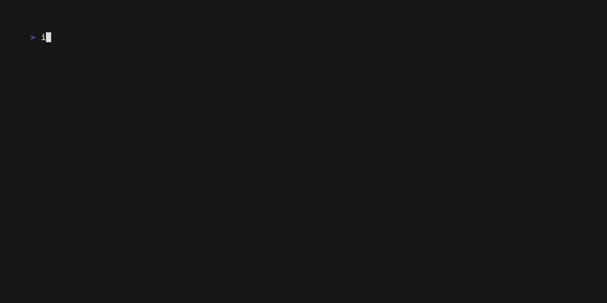

# Ignition

Ignition is a powerful CLI tool for building, managing, and running WebAssembly functions using [Extism](https://extism.org/). Think of it as "Docker for WebAssembly functions" - providing a familiar workflow for developers to build, share, and execute WebAssembly modules without the complexity.



## Why Ignition?

- **Language-agnostic**: Build WebAssembly functions in Rust, TypeScript, JavaScript, or Go
- **Simple workflow**: Familiar commands for building, running, and managing functions
- **Local registry**: Store and version your functions locally
- **Dual execution modes**: Run functions via CLI or HTTP API
- **Built on standards**: Uses Extism PDK for WebAssembly development

## Installation

```bash
# Install from source
git clone https://github.com/ignitionstack/ignition
cd ignition
go build
```

## Quick Start Guide

### 1. Start the Ignition Engine

The engine powers the HTTP API and function execution environment:

```bash
ignition engine start
```

### 2. Create a New Function

```bash
# Creates a new function project (interactive language selection)
ignition init my_function
```

### 3. Build Your Function

```bash
# Build with namespace/name:tag format
ignition build -t my_namespace/my_function:latest my_function/
```

### 4. Execute Your Function

**Method 1: Direct CLI Invocation**
```bash
# Call with optional entrypoint (-e) and payload (-p)
ignition call my_namespace/my_function -e greet -p "ignition"
```

**Method 2: HTTP API**
```bash
# First, load the function into the engine
ignition run my_namespace/my_function:latest

# Then call via HTTP (requires httpie or similar tool)
http POST http://localhost:8080/my_namespace/my_function/greet payload=ignition
```

> **Note:** The `run` command is only needed for HTTP API access. CLI invocation with `call` works without it.

## Function Development

### Configuration (ignition.yml)

Every function requires an `ignition.yml` configuration file:

```yaml
function:
  name: my_function
  language: rust  # rust, typescript, javascript, or go
  settings:
    enable_wasi: true  # Enable WASI capabilities
    allowed_urls:      # External URLs the function can access
      - "https://api.example.com"
```

### Supported Languages

Ignition provides templates for multiple languages:

| Language   | Based On          |
|------------|-------------------|
| Rust       | Extism Rust PDK   |
| TypeScript | Extism TS PDK     |
| JavaScript | Extism JS PDK     |
| Go         | Extism Go PDK     |

Each template includes project structure, dependencies, and example code.

## Managing Functions

### List Functions

```bash
# List all functions in a namespace
ignition function ls my_namespace/my_function
```

### Versioning with Tags

Functions use Docker-like tagging for versioning:

```bash
# Build with specific tag
ignition build -t my_namespace/my_function:v1.0.0 my_function/
```

## HTTP API Reference

When functions are loaded with `ignition run`, they're accessible via HTTP:

```
http://localhost:8080/{namespace}/{function}/{endpoint}
```

**Example Request:**
```bash
http POST http://localhost:8080/my_namespace/my_function/greet payload=ignition
```

## Development Status

Ignition is under active development. APIs and features may change. We welcome your feedback and contributions!

## Resources

- [Extism Documentation](https://extism.org/docs/concepts/pdk/) - Learn about the WebAssembly PDK
- [GitHub Issues](https://github.com/ignitionstack/ignition/issues) - Report bugs or request features
- [Discord Community](https://discord.gg/EQeZY5utHC) - Get help and discuss ideas

## Similar Projects

- [Extism](https://extism.org/) - The Extensible Plugin System
- [WASI](https://wasi.dev/) - The WebAssembly System Interface
- [Spin](https://developer.fermyon.com/spin/index) - WebAssembly microservices framework

## License

MIT License - see [LICENSE](LICENSE) for details.
